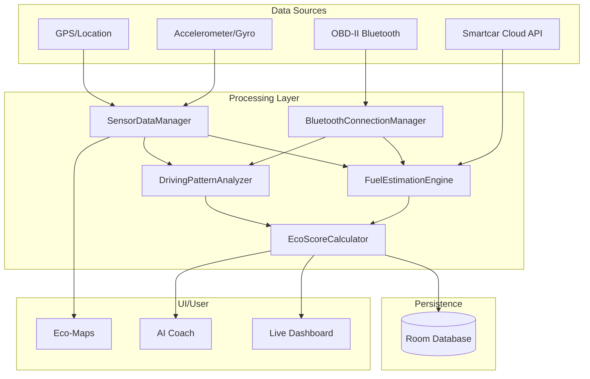

# EcoDrive: Technical Architecture & Metric Derivation

This document provides a deep dive into the engineering principles, data pipelines, and mathematical models that power EcoDrive.

---

## 🏗️ High-Level System Architecture

EcoDrive uses a multi-layered architecture to process high-frequency sensor data and provide real-time coaching.

---

## 📊 Metric Derivation & Data Pipelines

EcoDrive calculates metrics using three distinct pipelines depending on available hardware.

### 1. Phone Sensor Pipeline (IMU + GPS)
When no OBD-II hardware is connected, EcoDrive relies on the phone's internal sensors.

**Flow:**
1. **GPS (1Hz):** Provides ground speed ($v$), latitude, longitude, and altitude ($h$).
2. **IMU (50Hz):** Provides high-frequency longitudinal and lateral acceleration ($a$).
3. **Fusion:** The `SensorDataManager` aligns IMU readings with GPS timestamps.
4. **Road Grade:** Calculated as $\Delta h / \Delta d$ over 20m windows to filter noise.
5. **Consumption:** Calculated via the **Vehicle Specific Power (VSP)** model.

**Formula for Fuel Rate ($L/h$):**
The engine uses the VSP model to estimate instantaneous power requirement:
$$VSP = v \cdot (a \cdot (1 + \epsilon) + g \cdot \sin(\theta) + g \cdot C_r \cdot \cos(\theta)) + \frac{0.5 \cdot \rho \cdot C_d \cdot A \cdot v^3}{m}$$
Where:
- $v$: velocity, $a$: acceleration
- $\epsilon$: mass factor for rotating parts
- $\theta$: road grade angle
- $C_r$: rolling resistance, $C_d$: drag coefficient
- $A$: frontal area, $m$: vehicle mass

### 2. OBD-II Pipeline (Direct Engine Telemetry)
When an ELM327 adapter is connected, EcoDrive bypasses estimation for key engine metrics.

**Flow:**
1. **Polling:** `BluetoothConnectionManager` polls the ECU via AT/OBD commands.
2. **MAF (Mass Air Flow):** The primary metric for fuel calculation.
3. **RPM & Load:** Used for fine-grained efficiency analysis.

**Formula for Fuel Rate from MAF:**
$$FuelRate (L/h) = \frac{MAF \cdot 3600}{AFR \cdot \rho_{fuel} \cdot 1000}$$
Where:
- $AFR$: Stoichiometric Air-Fuel Ratio (14.7 for Gasoline).
- $\rho_{fuel}$: Fuel density (e.g., 0.745 kg/L for Gasoline).

### 3. Smartcar API Pipeline (Ground Truth & Calibration)
Smartcar acts as the "Ground Truth" to bridge the gap between phone estimation and reality.

**Flow:**
1. **Pre-Trip:** Query Smartcar for initial fuel level ($F_{start}$) and odometer ($O_{start}$).
2. **Post-Trip:** Query Smartcar for end fuel level ($F_{end}$) and odometer ($O_{end}$).
3. **Actual Consumed:** $Actual = (F_{start} - F_{end}) \cdot TankCapacity$.
4. **Calibration:** If $Actual \neq Estimated$, the `FuelEstimationEngine` updates its `calibrationFactor` for future trips.

---

## 🧠 Eco Score Calculation

The Eco Score (0-100) is a weighted metric derived from six categories:

| Category | Source | Logic | Weight |
| :--- | :--- | :--- | :--- |
| **Acceleration** | IMU/OBD | Frequency of events $> 3.0 m/s^2$ | 20% |
| **Braking** | IMU/OBD | Frequency of events $< -3.5 m/s^2$ | 20% |
| **Speed** | GPS/OBD | Time spent in "Eco-Range" (70-90 km/h) | 20% |
| **Cornering** | IMU | Lateral G-forces $> 4.0 m/s^2$ | 15% |
| **Idling** | GPS/OBD | Ratio of stationary engine-on time | 10% |
| **Consistency** | GPS/OBD | Standard deviation of speed ($\sigma$) | 15% |

---

## 🗺️ Maps & Eco-Routing

### Hybrid Map Implementation
EcoDrive uses a **Dual-Map Engine**:
- **Google Maps (Native):** Used for standard navigation and real-time dashboard tracking.
- **OpenStreetMap / Leaflet (WebView):** Used as a fallback and for high-customization trip history overlays.

### Route Optimization Logic
When calculating an "Eco-Route", the `RouteOptimizer` performs a "Virtual Drive":
1. Fetches route geometry (polyline) from OSRM or Google Directions.
2. Samples road grade along the path using Elevation APIs.
3. Runs the **VSP Model** across every segment of the route at predicted speeds.
4. Sums the total estimated fuel consumption and CO2 output.
5. Returns the route with the lowest total energy cost, which may differ from the "Fastest" route.

---

## 🛠️ Data Integrity & Reliability

- **Foreground Services:** `SensorForegroundService` and `ObdForegroundService` ensure data collection is not interrupted by Android's Doze mode or low-memory killer.
- **Sensor Filtering:** A low-pass Butterworth filter is applied to raw accelerometer data to remove high-frequency noise from road surface irregularities.
- **Auto-Recovery:** If a Bluetooth OBD connection drops, the system seamlessly falls back to phone-sensor-only mode without interrupting the trip recording.
